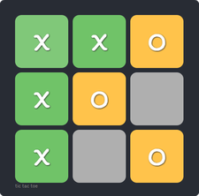

# Tic Tac Toe in React

<br>

A React implementation of Tic Tac Toe. Check out [here](https://alicoskun.github.io/demo/tic-tac-toe-reactapp/index.html)

This project template was built with [Create React App](https://github.com/facebookincubator/create-react-app), which provides a simple way to start React projects with no build configuration needed.

## Available Scripts

In the project directory, you can run:

### Install packages
```
npm install
```
### Run app
```
npm start
```

Runs the app in the development mode.<br>
Open [http://localhost:3000](http://localhost:3000) to view it in the browser.

The page will reload if you make edits.<br>
You will also see any lint errors in the console.
